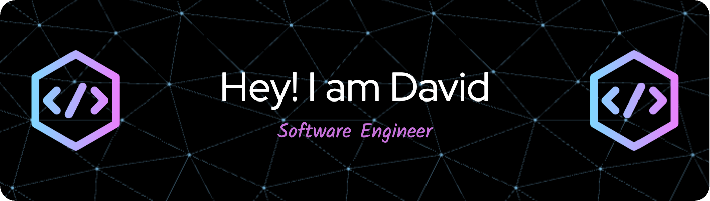

- 📚 I am a student at **McGill University**

- 👨‍💻 I am currently building a **Go Interpreter**

- 📄 All of my projects are available at [david-zhou-portfolio](https://david-zhou-portfolio.netlify.app/)

- 📫 Reach me at **david.zhou.0110@gmail.com**

<h3 align="left">Connect with me:</h3>

<h3 align="left">Languages and Tools:</h3>

  
  
  
  
  

